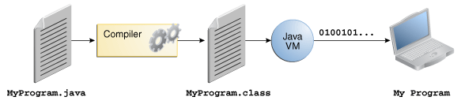

* Java technology
  * 👀== programming language + platform 👀

# Java programming language
* Simple
* Object oriented
* Distributed
* Multithreaded
* Dynamic
* Architecture neutral
* Portable
* High performance
* Robust
* Secure

## How does it work?
* ".java"
  * == plain text files / contains ALL source code  
* `javac`
  * compiler / ".java" -- are compiled into -- ".class"
* ".class"
  * == file / contains bytecodes
    * NOT native | your processor
    * == Java Virtual Machine's machine language
  * can be run | DIFFERENT OS
    * Reason: 🧠JVM is available | DIFFERENT OS 🧠
      
* `java`
  * == 👀launcher tool 👀 / runs your application + instance of the JVM

# Java Platform
* Platform
  * == OS + underlying hardware 
  * == hardware or software environment | program runs
    * _Example:_ Microsoft Windows, Linux, Solaris OS, and Mac OS
* Java Platform
  * vs OTHER Platforms
    * 💡software-only platform / runs | OTHER hardware-based platforms 💡
  * slower than native code
    * Reason: 🧠platform-independent environment 🧠
  * 👀== JVM + Java API 👀
    * Java API
      * split in packages == libraries of related classes 
  
  
